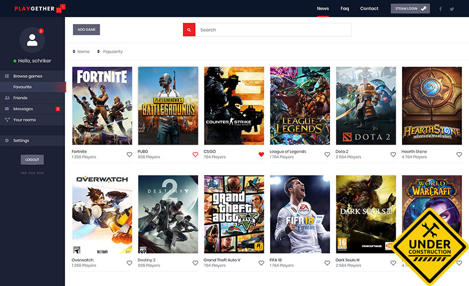

# Play2Gether

[Demo](https://p2g.janusmarcin.pl/) - alpha of alpha version.

Social platform for gamers that will allow find people for cooperative or multiplayer games.  

## What I use?
App is build with:
* [React](https://reactjs.org/) - i use Create React App
* [Redux](https://redux.js.org/) - for state management
* [Router](https://github.com/ReactTraining/react-router) - for routing
* [Sass](https://sass-lang.com/) - simply just sass
* [Firebase](https://firebase.google.com/) - for user auth, database, file storage and hosting 
* [Formik](https://github.com/jaredpalmer/formik) - for forms handling (It rocks!)

## Things that works
* Users can create account and login.
* Users can search through games/rooms
* Users can sort games/rooms by number of players or by the game name
* Users can add games/rooms to their favorites
* Users can enter games/rooms
* Users can add new rooms
* Users can chat in room view

## To do
* Favorites view
* Private messages
* Adding user to friends
* User rooms view
* User settings view
* And a lot of other stuff…

## Installation
You can just clone repository files and run to install all dependencies:

`npm install`

After that just run to start server:

`npm start`

To build project:

`npm run build`

*All project files are located in ./src/*

## Changelog

### v0.2-alpha - 05.10.2018

* Added single room view witch chat when players can spam some messages. Right now everyone can enter the room and chat. Need to add ability to join the room.
* Added custom domain.
* Fixed some bugs.